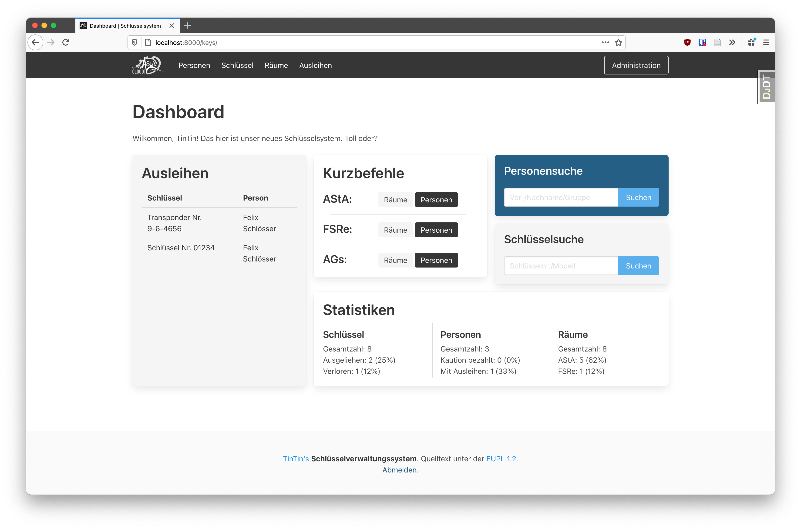

# Digitale Verwaltung
A key management system written in django

## Database Setup

### Ubuntu 20.4
Install Postgres:
`sudo apt update`
`sudo apt install postgresql postgresql-contrib`

Access the postgres cli as the automatically created 'postgres' os-user:
`sudo -u postgres psql`

Next, create a database and user. Make sure to change the password:
`CREATE DATABASE asta_administration_db;`
`CREATE USER django WITH PASSWORD 'changeme';`

Modify a few of the connection parameters for the user:
`ALTER ROLE django SET client_encoding TO 'utf8';`
`ALTER ROLE django SET default_transaction_isolation TO 'read committed';`
`ALTER ROLE django SET timezone TO 'Europe/Berlin';`

Give the new user access to administer our new database:
`GRANT ALL PRIVILEGES ON asta_administration_db TO django';`

Exit the PostgreSQL prompt:
`\q`

## Python Virtualenv
`sudo apt install python3-venv python3-pi`
`sudo apt install python3-pip``

`python3 -m pip install --upgrade pip`

`python3 -m venv .django-env`
`source .django-env/bin/activate`

`pip install -r requirements.txt`

## Starting Dev Server
`python manage.py runserver`
